= Parapente
:Author: Romain Le Drogo
:toc:
:sectnums:
:cfs: (cf. capture d'écran ci-dessous)
== Comment faire une analyse météo ?

On part du général vers le particulier.

Le but est de répondre aux questions suivantes : 

* Où vais-je pouvoir voler tel jour ?
* Sur quel(s) créneau(x) horaire(s) ?
* Dans quelles conditions ?

=== Consulter la carte météo du pays

Le but est de répondre à la question suivante : dans quelle région vais-je pouvoir voler tel(s) jour(s) ?

Pour cela, on va devoir répondre à la question suivante : dans quelle(s) zone(s) fait-il beau et quels jours ?

On en profitera également pour répondre à la question suivante, cela nous servira par la suite : quelle est la direction générale du vent dans le pays ?

On peut répondre à la question « Dans quelle(s) zone(s) fait-il beau et quels jours ?  » en se rendant sur le site de https://meteofrance.com[Météo France] {cfs}.

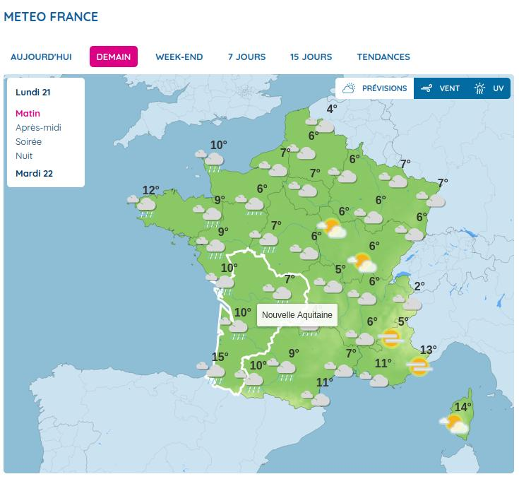

On peut répondre à la question « Quelle est la direction générale du vent dans le pays ? » en se rendant sur le site de https://meteofrance.com[Météo France] {cfs}.

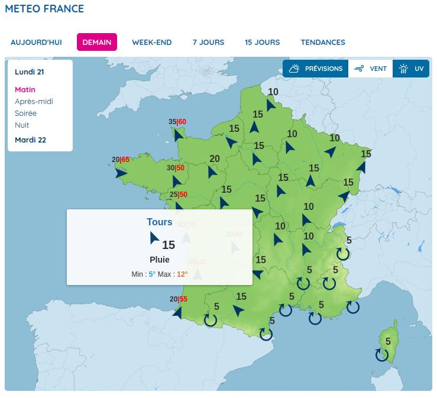

=== Consulter la carte météo de la zone

Le but est de répondre aux questions suivantes : 

. Est-ce qu'il pleut ou pas ? Si oui, où et sur quels créneaux horaires ?
. Quelle est la direction générale du vent dans la zone ?
. Quels sites de vol vais-je étudier plus en profondeur ?

Comment obtenir l'information ?

En se rendant sur un site comme https://www.meteoblue.com/fr/meteo/semaine/talloires_france_2973480[Météo Blue]

==== Réponse à la première question

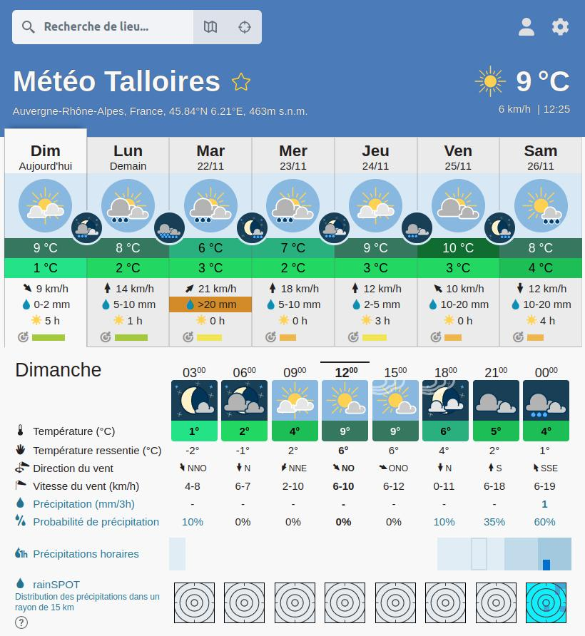

Dans l'image ci-dessus, on peut voir :

. Que le dimanche :

    * Il fait beau.
    * Il ne devrait pas pleuvoir.
    * Le vent vient du nord-ouest.
    * La force du vent est raisonnable (9 km/h).
    * En première approche, la météo semble favorable à la pratique du parapente.

. Que le lundi :

    * Le temps est incertain.
    * Il pourrait pleuvoir.
    * Le vent vient du sud, ce qui pourrait renforcer la brise de vallée.
    * La force du vent est relativement importante (14 km/h).
    * En première approche, la météo semble incertaine pour pratiquer le parapente. Il faut étudier plus finement la météo de ce jour-là.

. Que le mardi :

    * Le temps est incertain.
    * Il devrait pleuvoir.
    * Le vent vient du sud-ouest.
    * La force du vent est importante (21 km/h).
    * En première approche, la météo semble défavorable à la pratique du parapente.

. Que le mercredi : la situation est similaire à lundi.

. Que le jeudi :

    * Il fait beau.
    * Il ne devrait pas pleuvoir.
    * Le vent vient du sud, ce qui pourrait renforcer la brise de vallée.
    * La force du vent est relativement importante (12 km/h).
    * En première approche, la météo semble favorable à la pratique du parapente.

. Que le vendredi :

    * Il fait couvert.
    * Il pourrait pleuvoir.
    * Le vent vient du sud-est.
    * La force du vent est raisonnable (10 km/h).
    * En première approche, la météo semble plutôt favorable à la pratique du parapente. Toutefois, il faut étudier plus finement la météo de ce jour-là.

. Que le samedi :

    * Le temps est incertain.
    * Il pourrait pleuvoir.
    * Le vent vient du nord, il pourrait aller à l'encontre de la brise de vallée.
    * La force du vent est raisonnable (10 km/h).
    * En première approche, la météo semble plutôt favorable à la pratique du parapente. Toutefois, il faut étudier plus finement la météo de ce jour-là.

On étudie plus finement le lundi.

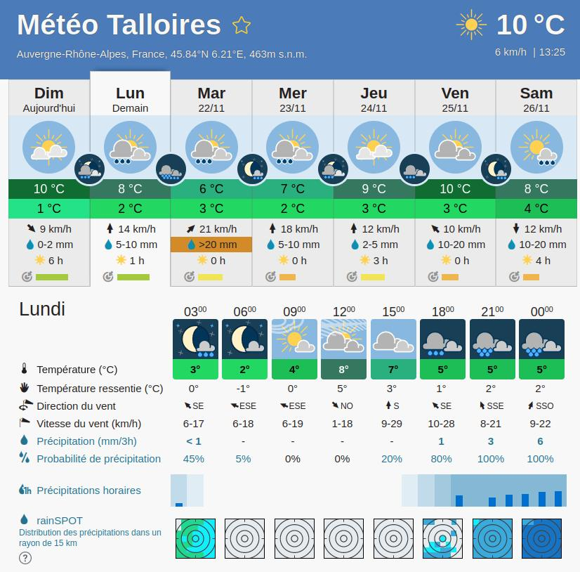

On peut voir qu'il fait beau de 9 h à 18 h et que le mauvais temps que l'on avait précédemment noté ne se manifestera qu'après 18 h. Par ailleurs, si la force du vent semble relativement importante le matin, elle s'intensifie de plus en plus jusqu'à 18 h. On peut donc en conclure que le temps est plutôt favorable le lundi mais qu'il faudra se méfier de la force du vent. Il faudra consulter les prévisions de la force du vent la veille au soir ou le matin même.

On étudie plus finement le mardi.

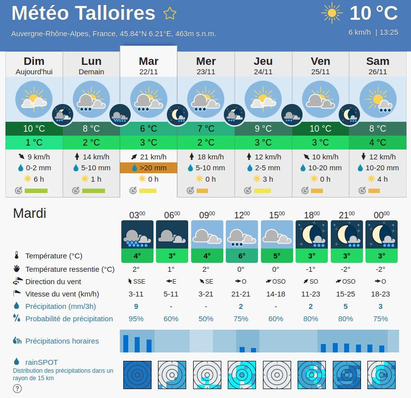

On peut voir que le temps est couvert de 9 h à 18 h et qu'il devrait pleuvoir de 12 h à 15 h. Par ailleurs, les probabilités de précipitations sont au moins égales à 50 % de 9 h à 18 h, atteignant même 75 % de 12 h à 15 h. Par conséquent, on peut estimer que notre conclusion en première approche est confirmée : la météo du mardi ne sera pas favorable à la pratique du parapente. 

On étudie plus finement le mercredi.

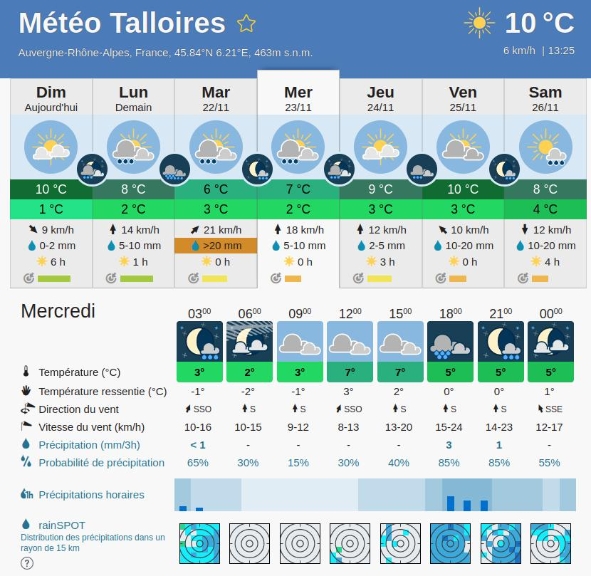

On peut voir que le temps est couvert de 9 h à 18 h et que le mauvais temps que l'on avait précédemment noté ne se manifestera qu'après 18 h. Par ailleurs, la force du vent semble rraisonnable, elle s'intensifie de plus en plus jusqu'à 18 h. On peut donc en conclure que le temps est plutôt favorable le mercredi.

De même, on étudie le jeudi et le vendredi.

Par conséquent, on peut estimer que :

. Le temps est favorable à la pratique du parapente le dimanche.
. Le temps est plutôt favorable à la pratique du parapente le lundi.
. Le temps est défavorable à la pratique du parapente le mardi.
. Le temps est favorable à la pratique du parapente le mercredi.
. Le temps est favorable à la pratique du parapente le jeudi.
. Le temps est plutôt favorable à la pratique du parapente le vendredi.

On peut donc estimer qu'il est possible de voler 6 jours sur les 7 prochains jours.

On peut donc décider de voler dans le bassin d'Annecy pendant ces 7 jours.

Il reste maintenant à choisir un site pour un jour précis.

==== Détermination de la direction générale du vent

On va étudier plus finement le lundi.

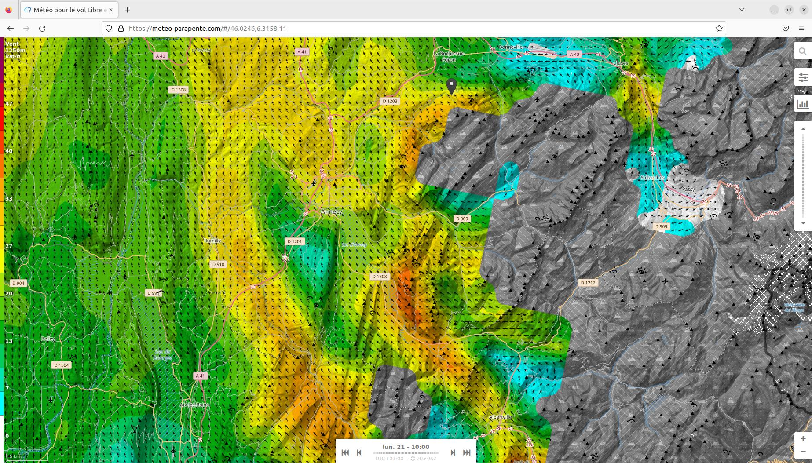

On peut voir que la direction générale du vent à 1250 m à 9 h est sud-est.

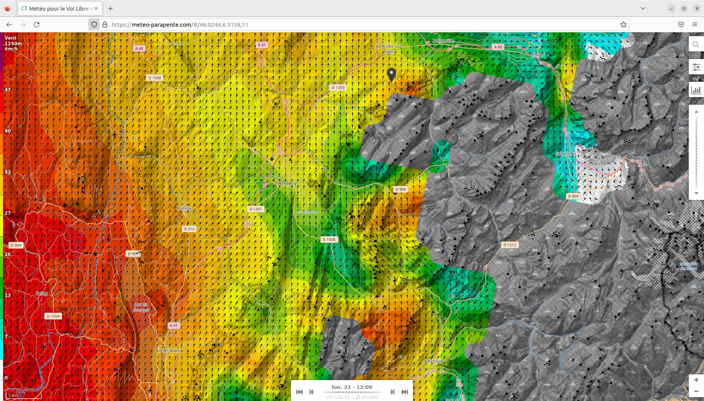

On peut voir que la direction générale du vent à 1250 m à 12 h est sud.

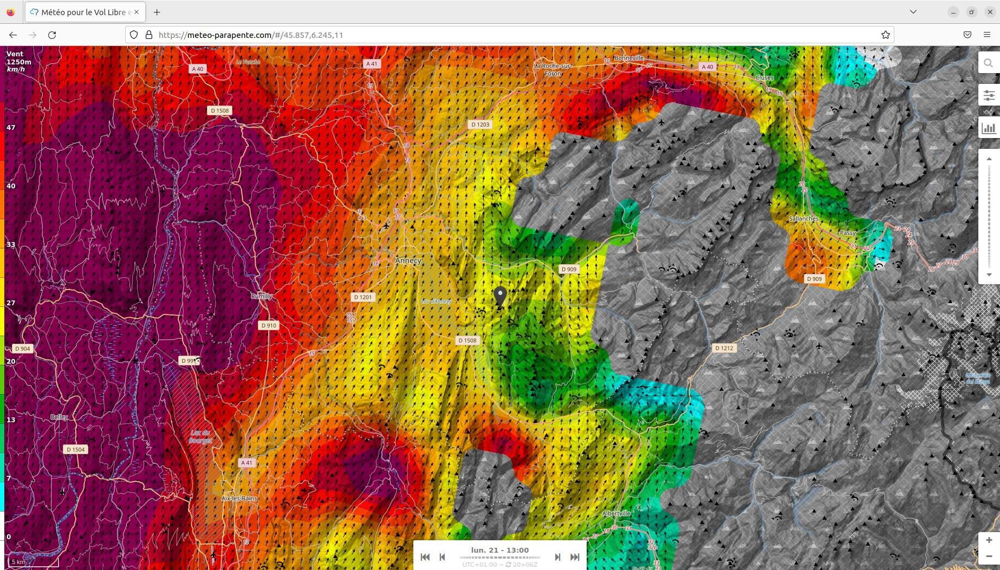

On peut voir que la direction générale du vent à 1250 m à 13 h est sud-ouest.

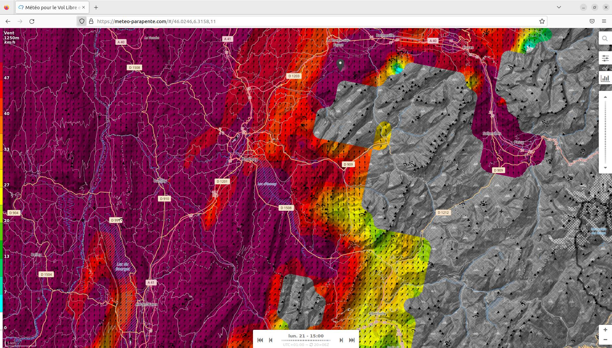

On peut voir que la direction générale du vent à 1250 m à 15 h est sud-ouest.

On voit donc que le vent vient du sud-est le matin, du sud à 12 h et du sud-ouest l'après-midi.

Par conséquent, si l'on veut voler le matin, il vaut mieux choisir un lieu exposé au sud-est et si l'on veut voler l'après-midi, il vaut mieux choisir un lieu exposé au sud-ouest.

==== Détermination d'un site de vol

Mettons que l'on veuille voler l'après-midi, il faut donc choisir un site exposé au sud-ouest. Pour cela, on peut se référer au https://carte.ffvl.fr/?mode=parapente[site de la FFVL].

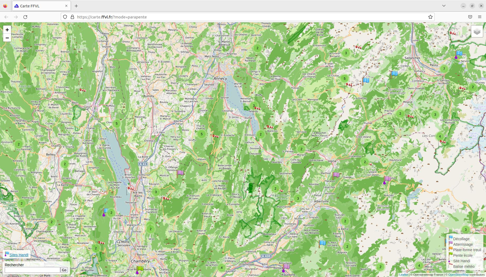

=== Étudier un site de vol

Le but est de répondre aux questions suivantes :

* Va-t-il faire beau sur le site de vol considéré ? Si oui, sur quel(s) créneau(x) horaire(s) ?
* Quelle vont être la direction et la force du vent sur le site de vol considéré tout au long de la journée ?
* Comment va évoluer la température du site sur le site de vol, par rapport au point de rosée, tout au long de la journée ?

Comment obtenir l'information ?

En se rendant sur un site comme ffdsfds[Météo Parapente]

